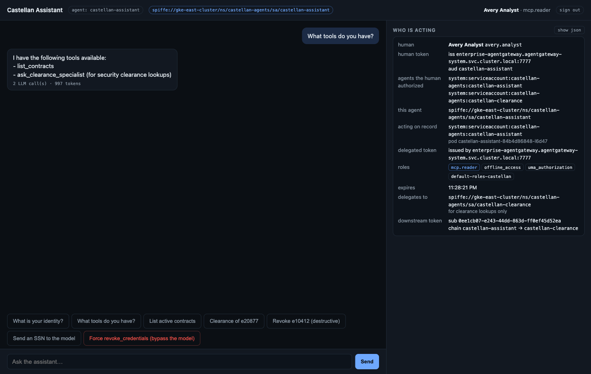
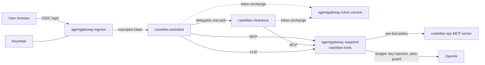

# Agent mesh demo: securing AI agents on the service mesh you already run

An AI agent acts for a user, runs like a service, and behaves nondeterministically. A service mesh already
authenticates it. This demo shows the part the mesh does not cover on its own: **what the agent is allowed
to do once authenticated**. It covers which tools it may call, on whose behalf, through which other agents,
with what model budget, and what data it may send to a model.

It runs on the **Solo distribution of Istio** in ambient mode. **Solo Enterprise for agentgateway** runs as
the Istio **waypoint**, on the same control plane. There is no second mesh, no sidecar and no security code
in the agent.

The demo is a Jupyter notebook (Bash kernel) plus a small chat app. You run the notebook cell by cell, and
watch the effect in the browser.



## What the demo shows

| Beat | What you see |
|---|---|
| Human identity stops at the edge | The user signs in to Keycloak at the agentgateway ingress. The ingress exchanges the corporate token for one scoped to a single agent, so the agent never holds the user's IdP token. |
| Agent identity comes from the mesh | The agent's SPIFFE identity (`spiffe://<cluster>/ns/castellan-agents/sa/castellan-assistant`) is issued by Istio through ztunnel. The agent configures no certificate. |
| Delegation, not impersonation | The agent exchanges the user's token plus its own service-account token at the agentgateway token service (RFC 8693). The result says "this human, through this agent". |
| Least privilege per MCP tool | One policy filters `tools/list` and rejects `tools/call` per tool. Each rule requires the workload identity, the user's role, and the user's consent to that agent. |
| The model is not the control | A "force the call" button skips the model and calls the tool directly. The waypoint refuses it, and the MCP server never sees it. |
| Agent-to-agent | The assistant hands clearance lookups to a specialist agent. The token at the tool carries the whole chain: user, then assistant, then specialist. |
| Unauthorized agent | A shadow agent with the same login gets zero tools, because the user never authorized it. |
| LLM budgets | Per-agent token budgets, created in the Solo UI. The chat hits a 429 when the budget is spent. |
| Data guard | A prompt containing a Social Security Number never reaches the model. |
| Evidence | The Solo UI shows each call with the workload, the user, the agent chain, the tool and the model. A service graph shows who talks to whom. |

## Architecture



Namespaces:

| Namespace | Runs |
|---|---|
| `castellan-idp` | Keycloak, standing in for the enterprise identity provider. |
| `castellan-ingress` | The agentgateway ingress that terminates the user login. |
| `castellan-agents` | The assistant, the clearance specialist it delegates to, and a shadow agent nobody authorized, behind their own waypoint. |
| `castellan-tools` | The `castellan-ops` MCP server and the LLM egress, behind the agentgateway waypoint. |

## Prerequisites

**Licenses and keys**

| Variable | What |
|---|---|
| `SOLO_ISTIO_LICENSE_KEY` | Solo distribution of Istio, Enterprise. Ask your Solo account team. |
| `AGENTGATEWAY_LICENSE_KEY` | Solo Enterprise for agentgateway, also used by the Solo UI. A Solo trial key covering both products works for both variables. |
| `OPENAI_API_KEY` | Used by the waypoint only. The agents never see it. |

**Tools:** `kubectl`, `helm` 3.x, `envsubst` (from `gettext`), `curl`, `python3`, and Jupyter with the
Bash kernel. `kind` and Docker are needed for a local cluster.

```bash
pip install jupyter bash_kernel && python3 -m bash_kernel.install
```

**A cluster**, either of these:

- **kind** on your laptop. Give Docker at least 4 CPUs and 10 GB of memory.
- **GKE**, or any conformant Kubernetes. Three `e2-standard-4` nodes are plenty.

## Quick start

```bash
git clone https://github.com/rvennam/agent-mesh-demo.git && cd agent-mesh-demo
export SOLO_ISTIO_LICENSE_KEY=...  AGENTGATEWAY_LICENSE_KEY=...  OPENAI_API_KEY=...

# 1. A cluster. Local:
./scripts/kind-up.sh
#    or GKE:
#    gcloud container clusters create agent-mesh --zone us-central1-c --num-nodes 3 --machine-type e2-standard-4
#    gcloud container clusters get-credentials agent-mesh --zone us-central1-c

# 2. The platform, on your current kubectl context (about 5 minutes):
./scripts/install.sh

# 3. The demo:
jupyter notebook agent-mesh-demo.ipynb
```

In the notebook, run the cells top to bottom. The first cells check the platform. The **Setup** cell
deploys the demo, and **Part 0** starts the port-forwards. Every later part says what to click in the
browser.

| Tab | URL | Notes |
|---|---|---|
| Chat | http://localhost:8080 | Sign in as `avery.analyst` (role `mcp.reader`) or `morgan.admin` (role `mcp.admin`). The password for both is `Castellan-Demo-2026`. **sign out** in the header switches users. |
| Shadow agent | http://localhost:8081 | Same login, a different agent that no user authorized. |
| Solo UI | http://localhost:4000/age/ | Tracing, Cost Management (budgets, model cost catalog), Gateways, Policies. |
| Service graph | http://localhost:4000/ie/graph | The Istio view of the same Solo UI. Group by **Workload**. |

The settings, including the cluster name (`CLUSTER_NAME`, default `agent-mesh`), live in
`scripts/00-env.sh`. They can be overridden from your shell.

## Using your own images

By default, the demo pulls the agent and MCP server images from this repo's GitHub Container Registry. They
are multi-arch, amd64 and arm64. To build and host them yourself:

```bash
REGISTRY=registry.example.com/agent-mesh ./scripts/build-images.sh
export AGENT_IMAGE=registry.example.com/agent-mesh/castellan-assistant:v0.3.5
export MCP_IMAGE=registry.example.com/agent-mesh/castellan-ops-mcp:v0.1.0
```

Export those two variables before you start Jupyter. The Setup cell renders `setup.yaml` with them.

## Repository layout

| Path | What |
|---|---|
| `agent-mesh-demo.ipynb` | The demo. Run with the Bash kernel from the repo root. |
| `scripts/install.sh` | Installs the platform: runs `01-istio.sh`, `02-agentgateway.sh` and `03-solo-ui.sh`. |
| `scripts/00-env.sh` | Versions, names, images and demo constants. Sourced by everything else. |
| `scripts/kind-up.sh` | Creates or deletes a local kind cluster. |
| `scripts/build-setup.sh` | Renders `setup.yaml`, everything the demo deploys, from `manifests/`. The notebook runs it. |
| `scripts/port-forwards.sh` | `start`, `stop` or `status` for the four browser tabs. Each forward reconnects on its own. |
| `scripts/build-images.sh` | Builds and pushes the two images to your registry. |
| `scripts/user-token.sh`, `mcp-tools.sh`, `mcp-call.sh`, `jwt-decode.py` | Command-line helpers for the optional proofs below. |
| `manifests/02-sts-token-exchange-values.yaml` | The agentgateway token service configuration (Helm values). |
| `manifests/50`, `52`, `55`, `61` | The policies the notebook applies live: per-tool MCP access, agent-to-agent caller rule, data guard, and a CLI budget. |
| `manifests/` (the rest) | Scaffolding rendered into `setup.yaml`: namespaces, Keycloak, MCP server, agents, waypoints, ingress with OIDC login and token rescoping, LLM egress, model cost catalog, tracing. |
| `agent/` | The chat agent, a small FastAPI app with the token exchange and MCP and LLM calls. All three agents use the same image. |
| `mcp-server/` | `castellan-ops`, an MCP server with four tools in three risk tiers. It does no authorization of its own. |
| `.github/workflows/images.yaml` | Builds and publishes the two images to GHCR. |

## How identity flows

1. Keycloak issues the user a token with `roles` and `authorized_agents`, the agents this user consents to
   act for them. The ingress runs the OIDC login. It then exchanges that token at the token service for one
   with `aud` set to the agent and only the allowed claims (`manifests/72-ingress-rescope.yaml`).
2. The agent sends that token as the subject and its own projected service-account token as the actor to
   the token service (port 7777). The result has `sub` set to the user, `act.sub` set to the agent, and the
   allowed claims listed in `manifests/02-sts-token-exchange-values.yaml`.
3. For clearance lookups, the assistant calls the specialist with its delegated token, and the specialist
   exchanges it again. The token then reads `act.sub` = specialist and `act.act.sub` = assistant.
4. Each MCP call carries the delegated token over mutual TLS. The waypoint verifies the token. The per-tool
   policy requires the workload identity from the peer certificate, every agent in the chain listed in
   `authorized_agents`, and a role.
5. LLM calls carry no API key. The waypoint injects it, counts tokens against the agent's budget, and
   applies the data guard.

## Optional: command-line proofs

With the Part 2 policies applied, these show the same decisions without the UI:

```bash
. scripts/00-env.sh
ACTOR=$(kubectl -n castellan-agents exec deploy/castellan-assistant -- cat /var/run/secrets/tokens/sts-actor)
USER_JWT=$(./scripts/user-token.sh avery.analyst)
DELEGATED=$(kubectl -n castellan-agents exec deploy/probe -- curl -s \
  http://enterprise-agentgateway.agentgateway-system.svc.cluster.local:7777/oauth2/token \
  -d grant_type=urn:ietf:params:oauth:grant-type:token-exchange \
  -d subject_token_type=urn:ietf:params:oauth:token-type:jwt -d subject_token="$USER_JWT" \
  -d actor_token_type=urn:ietf:params:oauth:token-type:jwt   -d actor_token="$ACTOR" | jq -r .access_token)
./scripts/jwt-decode.py "$DELEGATED"      # sub = the user, act.sub = the agent, roles
./scripts/mcp-tools.sh probe "$DELEGATED" # runs as the assistant's identity: the tools Avery may use
./scripts/mcp-tools.sh rogue "$DELEGATED" # another workload, same token: no tools
./scripts/mcp-tools.sh probe "$USER_JWT"  # a raw IdP token: 401
```

## Troubleshooting

- **Logins loop with `ERR_TOO_MANY_REDIRECTS`.** Keycloak runs in development mode and gets new signing keys
  whenever it restarts. The token service and the ingress's ext-auth cache the old ones. The Setup cell
  restarts both. If Keycloak restarts later, run:
  `kubectl -n agentgateway-system rollout restart deploy/enterprise-agentgateway deploy/ext-auth-service-enterprise-agentgateway`
- **A browser tab stops responding.** Run `./scripts/port-forwards.sh status`, then `start`.
- **The budget does not trip.** Budget counters live in Redis and survive deleting the budget. The notebook
  flushes them, and waits for the generated `RateLimitConfig` to be `ACCEPTED` before testing.
- **The Solo UI lost its history.** ClickHouse uses a temporary volume by default, so deleting the pod or
  its node erases traces and cost data. For anything long-lived, enable the management chart's
  `clickhouse.persistentVolume.enabled`.
- **The service graph shows a workload twice.** The Solo UI's `cluster` value and Istio's cluster ID must
  match. Both come from `CLUSTER_NAME`.

## Demo-only values

- **Credentials.** The Keycloak users, passwords and client secret in `scripts/00-env.sh` and
  `manifests/05-keycloak.yaml` are fictional and exist only inside the demo cluster. Do not reuse them.
- **Model prices.** The model cost catalog (`manifests/31-model-catalog.yaml`) sets prices about 3,000 times
  OpenAI's list price, so a few chat turns show visible spend. Real costs are a fraction of a cent.
- **The company.** "Castellan Defense Solutions" and its employees and contracts are fictional.

## Clean up

```bash
./scripts/port-forwards.sh stop
./scripts/kind-up.sh delete          # kind
# gcloud container clusters delete agent-mesh --zone us-central1-c   # GKE
```

## License

Apache License 2.0. See [LICENSE](LICENSE). The Solo products the demo installs are licensed separately.
